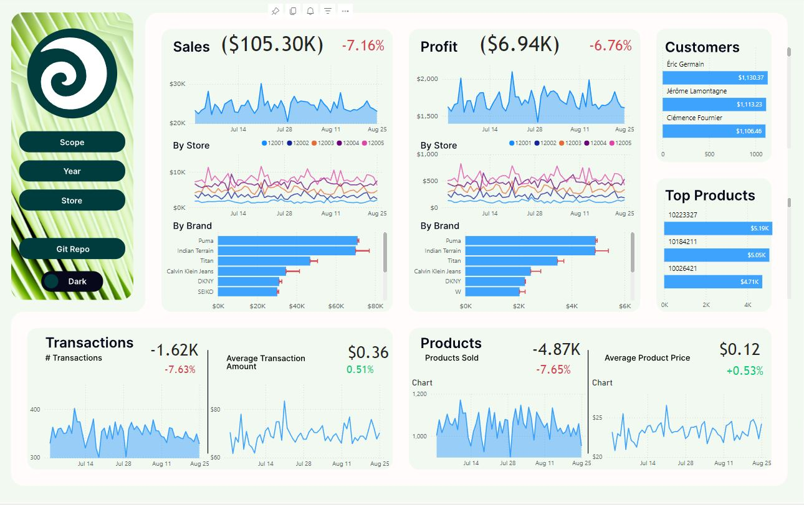

# Clothing Franchise Data Pipeline
This project implements an ETL data pipeline for generating and processing synthetic
transaction data for a business. The primary objective of this project is to test SSIS and SQL
Server as a data processing framework as well as evaluating Power BI as a reporting solution.
 Visit at: https://shorturl.at/myJl3

